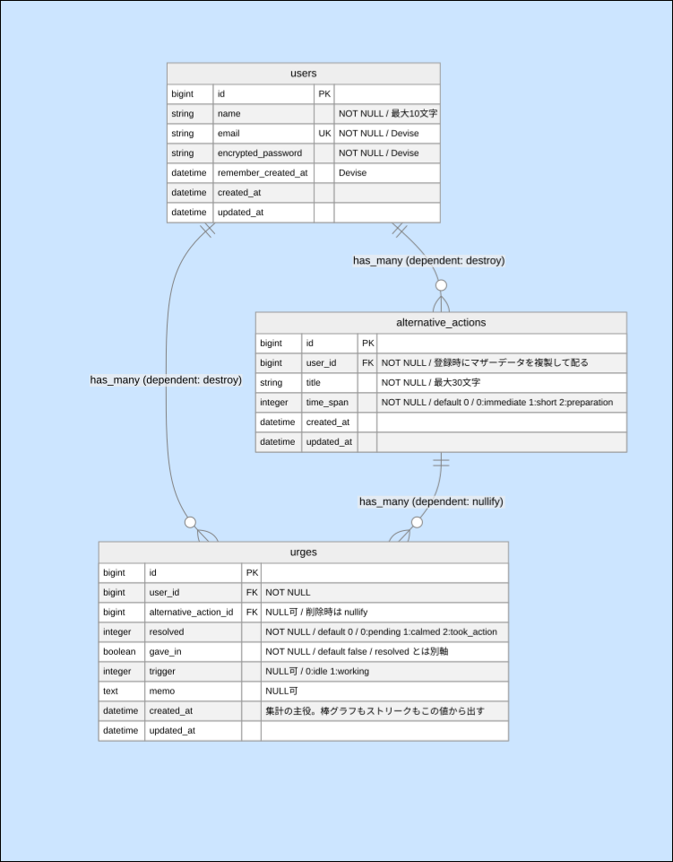

# Dopadori(ドパドリ)

SNS・ポルノ・タバコ・お酒への衝動を、**我慢させるのではなく代替行動で発散させる**Webアプリ。

**デモ**: ([https://dopadori-app.onrender.com/](https://dopadori-app.onrender.com/))<br> — ログイン不要で衝動ボタンだけ試せます。


<p>
  
  
  
</p>

---

## 何をするアプリか

衝動が来たら「衝動ボタン」を押す。**円を連打しながら、同時に 3-3-6 呼吸(3秒吸う・3秒止める・6秒吐く)を3セット、36秒間行います。**

連打は身体的な衝動(指を動かしたい感覚)をサンドバッグのように発散させ、呼吸は落ち着きを取り戻させます。36秒が終わったら「落ち着いた」か「代わりのことをする」かを選ぶと、衝動についての記録を残せます。

コンセプトは **「悪い刺激は0秒で来る。だから代替行動も0秒で始められるように用意しておく」**。

衝動が来た際に、「代わりに何をしようか」と考える一手間が、そのまま元の習慣に戻る隙になる。だから代替行動は**事前に登録しておき、衝動が来た瞬間にワンタップで出る**ようになっております。

---

## なぜ作ったか

開発者の僕自身、SNS・タバコ・ポルノに依存しておりました。
頭では「やめたい」と思っていても、やめられないものです。

過去僕は、依存対象を断てていた経験があります。
考えてみると、運動・読書などの**代わりの行動**によって衝動を置き換えていました。
ただ、「ご褒美として一日くらいはいいだろう」と、依存対象の行動を始めてしまうと、またそこから崩れるようになりました。

原因の分析としては、「意志力の問題」ではなく、「刺激の即効性・アクセスのしやすさ」だと考えております。
このアプリでは、  
刺激の即効性：ボタンの連打  
アクセスのしやすさ：連打後にワンタップで代替行動を提案  
を行うことで、衝動を「断つ」より「置き換える」ことを目的としています。


---

## 主な機能

| 機能 | 内容 |
|---|---|
| **衝動ボタン** | 連打 + 3-3-6 呼吸を36秒。終わると記録が1件作られる |
| **代替行動の管理** | 「今すぐできる / 少し時間がかかる / 準備がいる」の3区分で登録・編集・削除 |
| **代替行動の提案** | 衝動の直後、各区分から1つずつランダムに提示 |
| **記録** | 衝動が来た回数の棒グラフ(直近7日)と一覧。あとから「我慢できなかった」を付け外しできる |
| **ストリーク** | 衝動が来た時にアプリを開けた連続日数 |

ユーザー登録時に、代替行動の初期セット18件が自動で配られるため、行動を何も登録しなくてもすぐ使えます。

---

## 設計上の判断

このアプリは**何を作らないか**で形を決めていきました。依存を扱うアプリが、それ自体で新しい依存を作らない、という判断を軸にしています。

### 1. 数値を見せない

出していないもの:

- **連打の回数・スコア** — 「今日は100回押せた」という新しい達成のループを作ってしまう
- **36秒の残り秒数** — 進行はフェーズの文言と円の大きさで伝える
- **ストリークの最高記録** — 過去の自分がハードルになる。今続いている日数だけ出す
- **棒グラフの棒の上の数字** — 数字が並ぶと「多い / 少ない」の評価が生まれる

連打は**発散**であって、**達成**ではありません。

### 2. 「我慢できなかった」を enum の値にしない

当初は `resolved` という enum に `viewed`(見てしまった)を持たせる設計でしたが、実装直前に撤回しました。

**enum は状態を排他にするためです。**「3-3-6 をやって落ち着き、その2時間後に見てしまった」は両方とも実際に起きたことなのに、enum だと `viewed` に変えた瞬間に**「落ち着いた」という事実が消えることになります。**

つまり、このアプリが一番知りたい情報(発散したが衝動に走ったのか / 発散したら衝動が収まったのか)が、正直に記録した人ほど失われます。

そこで `gave_in`(boolean)として軸を分けました。`took_action` + `gave_in` は「代替行動をやった**上で**、それでも我慢できなかった」ということを表現できます。

### 3. ストリークは「我慢できなかった」日も切らさない

`resolved` も `gave_in` も問わず、すべての記録を数えます。

除外すると「正直に記録した瞬間に連続が切れる」構造になり、**記録すること自体が罰**になってしまいます。数えているのは「我慢できた日」ではなく「**衝動が来た時にアプリに手を伸ばした日**」。

### 4. 代替行動を「全部表示」しない

衝動が来た瞬間に選択肢を大量に並べると、**選ぶこと自体が認知的なハードル**になります。これはこのアプリが埋めようとしている「準備のワンクッション」そのものになってしまうと思っております。

そこで**各区分から1つずつランダムに提示**し、「今すぐできる」を主役にしました。選びたい人だけ「他の行動を選ぶ」から全一覧に行けるようになっています。

初期セットの代替行動も、`user_id` を持たない共有データにはせず、**登録時にユーザーごとのレコードとしてコピーして配っています。**そうすることで「膝が悪いから筋トレを消す」のような編集が最初からできます。

### 5. 棒グラフに Chart.js を入れなかった

数字・目盛り・凡例・ツールチップを全部出さない方針なので、**残るのは棒7本**しかなくライブラリの利点が消えるため、素の CSS で高さを出しています。

記録が0件の日も、棒を消さずに細い線を残しています。

---

## 技術構成

| 領域 | 使ったもの |
|---|---|
| 言語 / FW | Ruby 3.4.10 / Rails 8.1 |
| DB | PostgreSQL(開発: Docker / 本番: Neon) |
| 認証 | Devise |
| CSS | Tailwind CSS v4(cssbundling-rails) |
| JS | Hotwire(Turbo Drive / Stimulus)+ esbuild |
| テスト | RSpec / FactoryBot |
| 環境 | Docker Compose |
| デプロイ | Render(Web)/ Neon(DB) |

### 技術選定で決めたこと

**衝動ボタンのアニメーション**は、サーバーと通信せずブラウザ内で完結する動きなので、**Stimulus + カスタム CSS** で書いています。Stimulus は「いまどのフェーズか」を DOM に書くだけで、それが何色・何ミリ秒になるかは CSS 側が持ちます。状態と見た目の担当を分けました。

**日付の集計は必ずタイムゾーンを通す。**`config.time_zone = "Tokyo"` の環境で UTC のまま日付に変換すると、朝の記録が前日扱いになって**棒グラフとストリークが壊れます。**日別集計は SQL の `GROUP BY DATE()` ではなく Ruby 側で `in_time_zone` してからグルーピングしています。

---

## ER図




3テーブル構成。`users` / `alternative_actions` / `urges`。

---

## 開発の記録

- 開発期間: 2026年7月下旬 〜 8月(企画・設計を含む)
- 企画と設計の経緯は `docs/` に残しています
  - [`docs/app_concept.md`](docs/app_concept.md) — 企画・思想・変更履歴
  - [`docs/requirements.md`](docs/requirements.md) — 要件・DB設計
  - [`docs/design_guideline.md`](docs/design_guideline.md) — デザイン方針

**変更履歴を「何を・なぜ変えたか」の形で残しています。**結論だけでなく、採らなかった案とその理由も書いてあるので、後から同じ議論を蒸し返さないためです。

### 割り切ったこと

- **システムスペックを書いていません。**モデル層の spec のみ。期間内に確実に動くものを出すことを優先しました。
- **1ヶ月表示・お気に入り機能は入れてません。**記録の表示は直近7日のみ
- **小さい画面では衝動ボタン画面が縦に収まりきらない可能性あり。**中身が固定の高さなので、画面が小さいほど溢れます

---

## ローカルで動かす

```bash
  cp .env.example .env
  docker compose up
  ```

  初回はデータベースが空なので、別のターミナルで作成します。

  ```bash
  docker compose exec web bin/rails db:create db:migrate
  ```

  http://localhost:3200 で開きます(3000 ではありません)。

  ```bash
  # デモ用データ(development 専用)
  docker compose exec web bin/rails demo:seed

  # テスト
  docker compose exec web bundle exec rspec
  ```

  `demo:seed` は `demo@example.com` / `demodemo` で入れるアカウントと、直近14日分の記録を作ります。